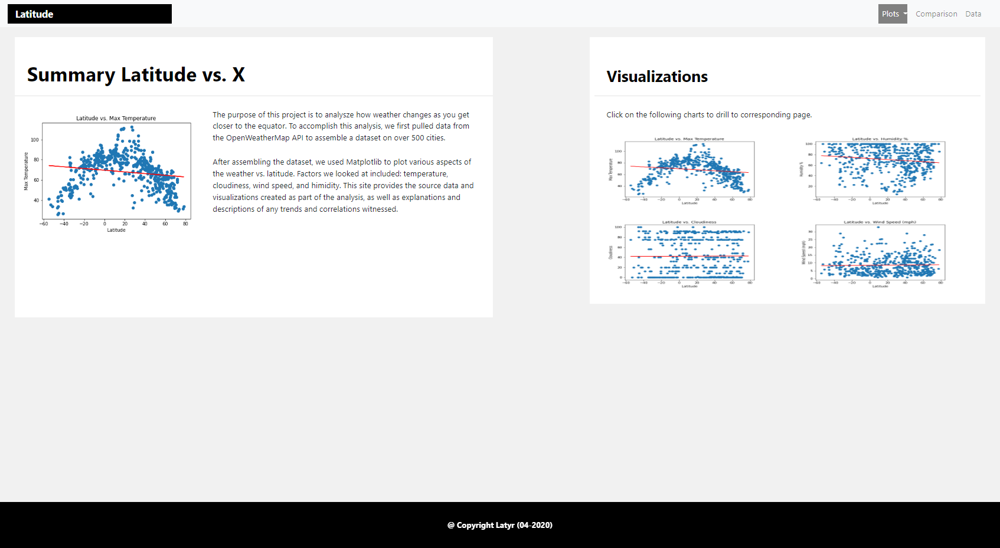
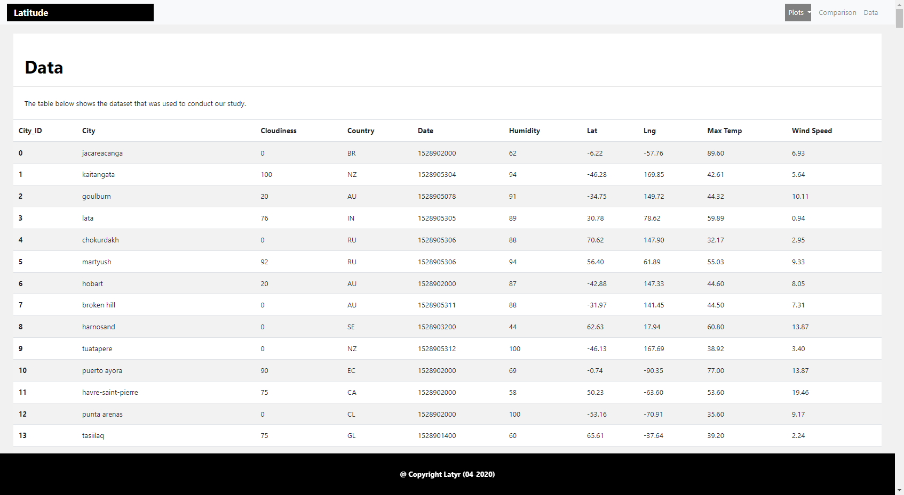

# 10_Visualization_Dashboard_Latitude_Web

In this assignment, the objective is to create a filtered form to display data in a table format.
The user selects the criteria and gets the data, then can reset form.

  

  

## **1. Authors**

This project was created and authored by:
* **Latyr Thiao**

## **2. Requirements / Specifications**

The [business & technical requirements](00-Instructions) that must be met by the solution.

## **3. Prerequisites**

The mandatory steps to be taken to make the code work smoothly.

### **3.1 License & Key**

Not applicable

### **3.2 Installing**

The assumption here is that your computer is running on Windows 10.
Feel free to adjust if you are using a Mac OS or any other operating system.

What software do you need and how to install them?

* Any web browser (Chrome, ...) 
* Any IDE that enable to write or read code (VS Code, ...)
* Python/Pandas

## **4. Tools & Coding Languages**

The following tools and coding languages were used:
* HTML
* Css
* Python/Pandas

## **5. Data Source(s)**

The data used as input is coming from the following sources:
*  [Data source](./02-Resources/cities.csv)

## **6. Run the code**

### ** The code is located here**
The code is available as follows:
* [Welcome Page](index.html)
* [Temperature](index_01_Visualization_Page_01_Temperature.html)
* [Humidity](index_01_Visualization_Page_02_Humidity.html)
* [Cloudiness](index_01_Visualization_Page_03_Cloudiness.html)
* [WindSpeed](index_01_Visualization_Page_04_WindSpeed.html)
* [Comparison Page](index_02_Comparison_Page_01.html)
* [Data Page](index_03_Data_Page_01.html)

* [CSS](styles.css) & [Reset](reset.css)

* [Jupyter Notebook](001_Weather_Analysis.ipynb)

## **7. User Acceptance Testing**

See related document to learn more about acceptence criteria:  
* [See instructions](00-Instructions)

## **8. Deployment**

* You could also deploy this entire folder with your preferred service provider (Github, ...) where a website can be hosted
* See [how to host a website on Github](https://www.youtube.com/watch?v=M5mg0r4ajt4&list=TLPQMTgwODIwMjFMJ3NIh8pJ7w&index=2)

## **9. Expected result**

The outcome should be similar to the below:

  

 

  

 
